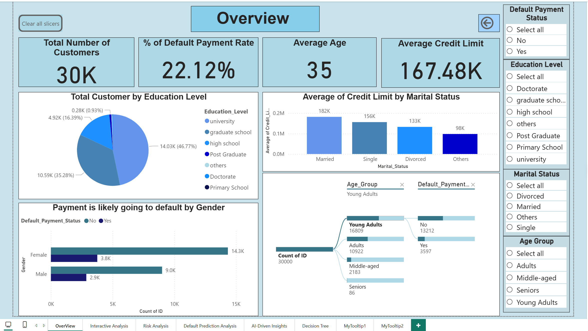
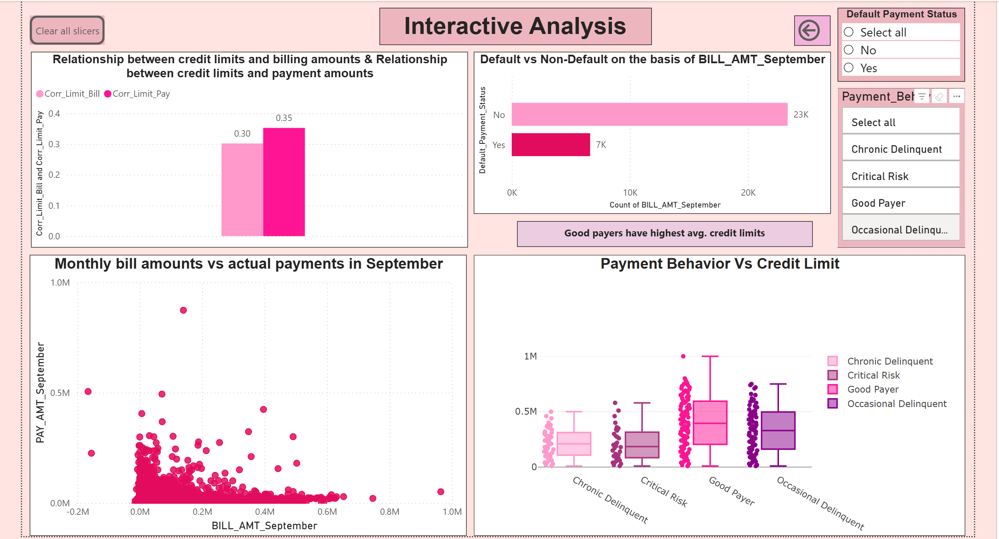
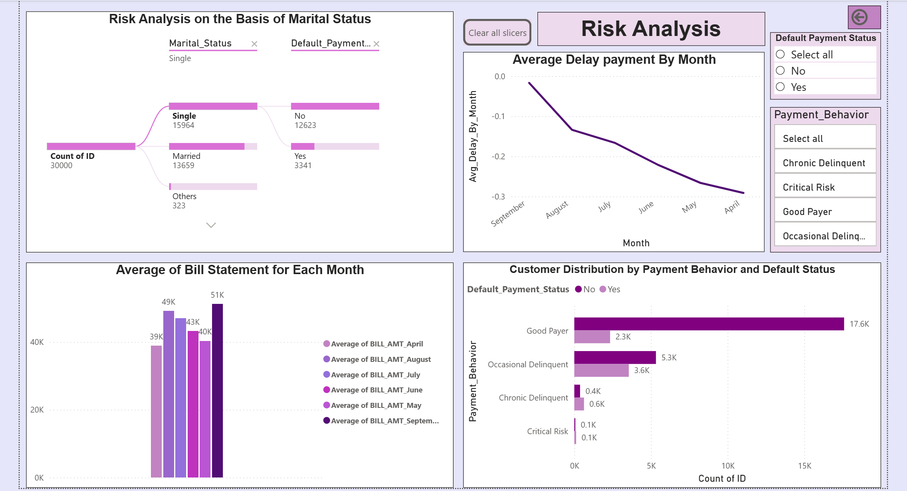
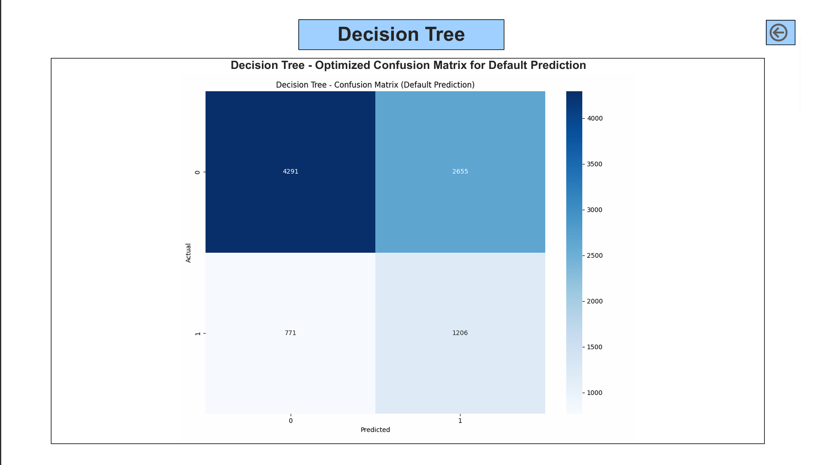

# Credit-Risk-Analysis Dashboard

## Project Overview
This project analyzes sales performance using the Northwind dataset.  
It highlights customer behavior, sales trends, and product performance with interactive dashboards.

## Tools Used
- Power BI (Data modeling, DAX, visualization)
- Excel (pre-processing)

## Files Included
- `Credit Risk Analysis.pbix` → Power BI report file  
- `credit card clients.csv` → Sample dataset  

## Key Insights
- Customer Behavior Trends
- Payment Behavior Insights
- Key Influencer Analysis

## How to View
- Download the `.pbix` file and open it in Power BI Desktop  
- Or view screenshots in the `/images` folder

## 🖼️ Dashboard Screenshots

